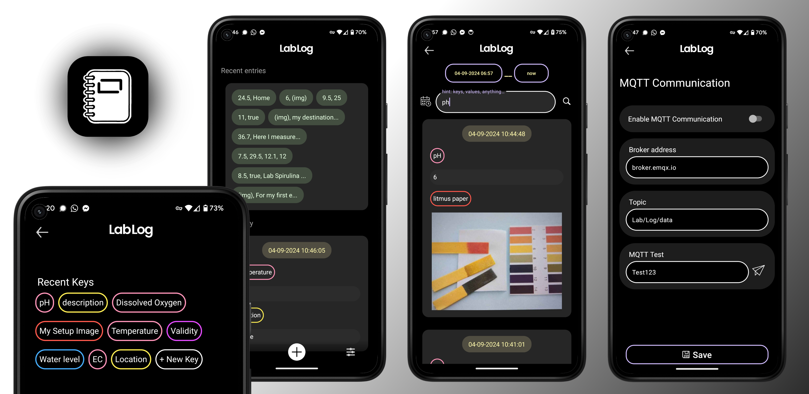

# LabLog

 

 

**LabLog** is a digital laboratory notebook designed to replace traditional paper notebooks in lab environments. It allows lab workers to easily record and manage sensor data, observations, and procedures, with automatic timestamping for each entry. LabLog supports both text and image-based data entries and integrates seamlessly with IoT sensors via MQTT for secure data storage. You have complete flexibility in how you use it, as you can create your own custom keys. **Each entry consists of key-value pairs that you define.**

LabLog is not just for lab use! **Individuals can also use it** and take advantage of its versatile logging capabilities for personal tasks. You can set your own custom keys and values, making it perfect for various use cases like fitness tracking, journaling, habit logging, or any other kind of data logging you need.

**Features:**
- **Automatic Timestamping**: Every entry is automatically timestamped.
- **Text and Image Support**: Log both numeric and textual data, as well as images.
- **IoT Integration**: Easily integrate with IoT sensors using the MQTT protocol.
- **Data Organization**: Entries are searchable and categorized for easy retrieval.
- **Import/Export**: Backup and restore your data with JSON file import/export.

### License

This project is licensed under the **GPL-3.0-or-later**. See the [LICENSE](./LICENSE) file for details.

Developed by **Jakob Kreft** and [contributors](https://github.com/jakobkreft/LabLog/graphs/contributors).
